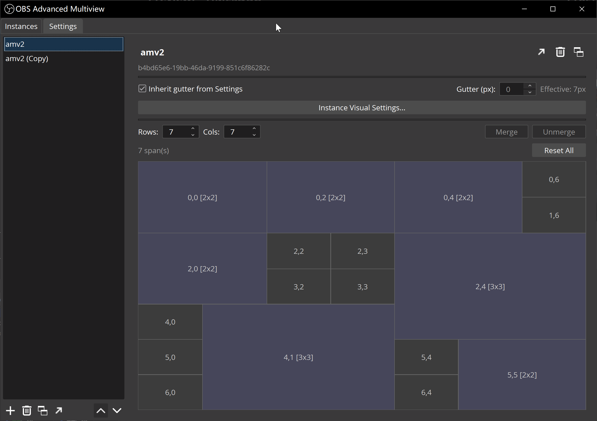
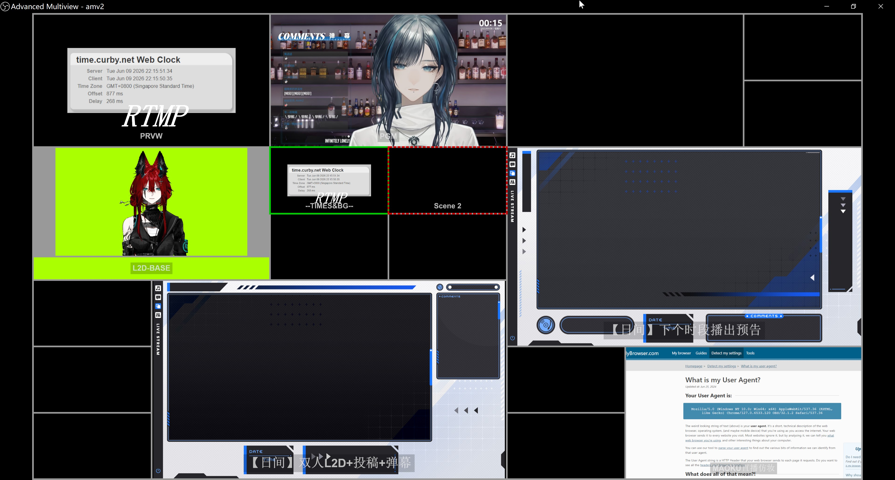

# OBS Advanced Multiview

OBS Advanced Multiview is an OBS Studio plugin that extends the built-in Multiview.

The built-in OBS Multiview is useful, but it is limited to fixed layouts and OBS internal scene monitoring. This plugin adds custom layouts, merged cells, per-cell display settings, external signal cells, audio-only cells, signal-lost handling, and multiple saved multiview instances.

It is intended for users who need OBS itself to provide a more complete monitoring view: live directors, stream operators, audio operators, VTuber teams, event crews, or anyone running a production where the default Multiview is too fixed.

[简体中文](README.cn.md)

| Manager | Multiview window |
| --- | --- |
|  |  |

## Compared with OBS Multiview

OBS Advanced Multiview keeps the same basic idea as OBS Multiview, but removes several fixed assumptions.

- OBS Multiview uses preset layouts. This plugin supports **custom rows, columns, merged cells, and gutter spacing**.
- OBS Multiview mainly monitors Program, Preview, and scenes. This plugin can also monitor **individual sources, audio-only sources, media URLs/files, NDI, Spout, and VLC playlists**.
- OBS Multiview has one global presentation style. This plugin has **global, instance, and per-cell display settings**.
- OBS Multiview does not provide detailed per-cell signal-lost handling. This plugin can show **missing-source states, placeholder images, signal-lost images, fallback states, and reconnect controls**.
- OBS Multiview is tied to one set of monitor views. This plugin lets you save and open multiple multiview instances with different layouts and settings.
- OBS Multiview does not create external monitoring feeds. This plugin creates external provider cells as private OBS sources where possible, so they do not need to be added to your normal scenes.

## Features

### Layouts and Windows

- Multiple saved multiview instances.
- One window per instance in the current release.
- **Custom row and column counts.**
- **Merged cells / span regions.**
- Gutter spacing from 0 to 50 px.
- Zero-gutter layouts with internal PGM/PRVW highlight borders.
- Layout and signal assignments are saved with the OBS scene collection.

### Internal OBS Monitoring

- Program cells.
- Preview cells.
- Scene cells.
- Source cells.
- **Audio-only source cells.**
- Scene-click switching: click a scene cell to send it to Preview in Studio Mode, or directly to Program outside Studio Mode.
- Optional double-click action for sending a scene cell to Program.

### External Signal Cells

- **FFmpeg media URLs and local files.**
- **DistroAV NDI sources.**
- **obs-spout2 Spout senders.**
- **VLC playlist cells** when OBS VLC source support is available.
- WebRTC is present as a placeholder provider, but runtime support is not implemented yet.
- NDI and Spout are accessed through host OBS plugins. This plugin does not bundle the NDI SDK or a separate Spout SDK.

### Visual Settings

- **Global visual settings.**
- **Instance visual settings.**
- **Per-cell visual settings.**
- Background color.
- Background image.
- Label display modes.
- Safe area guides.
- Foreground overlay image.
- PGM/PRVW highlight borders.
- **Nested scene detection** for PGM/PRVW highlights.
- **VU meters.**
- VU peak hold.
- VU dB scale ticks and labels.
- **VU multi-channel display** based on source channel count.
- **VU RMS / magnitude indicator.**

### Signal-Lost Handling

- **Missing-source overlay.**
- **Signal-lost overlay.**
- Placeholder image.
- Signal-lost image.
- Fallback image.
- Fallback to PGM, PRVW, scene, or source where supported.
- **Reconnect Now** action.
- Retry and fallback behavior for external providers.
- Replay, previous, play/pause, and next actions for supported media providers.

### Workflow Details

- **Right-click cell menu** for source assignment, source editing, display settings, signal-lost settings, reconnect, and media controls.
- Settings are stored under OBS plugin configuration paths.
- English and Simplified Chinese UI localization.
- Built with the OBS plugin template, Qt 6, C++17, libobs, and OBS frontend APIs.
- Windows is the primary tested platform for the current release candidate.

## Requirements

- OBS Studio 31.1.1 or newer.
- Windows is the primary tested platform.
- Optional host plugins for external providers:
  - DistroAV for NDI cells
  - obs-spout2 for Spout cells
  - OBS VLC source support for VLC playlist cells

macOS and Linux support is planned through the cross-platform build system, but current validation is Windows-first.

## Installation

Download a release archive from GitHub Releases.

For OBS portable installs, use the portable archive and extract it into the OBS root folder so the final layout contains:

```text
obs-plugins/64bit/obs-advanced-multiview.dll
data/obs-plugins/obs-advanced-multiview/locale/en-US.ini
data/obs-plugins/obs-advanced-multiview/locale/zh-CN.ini
```

Restart OBS, then open the plugin from:

```text
Tools -> OBS Advanced Multiview
```

For development or local testing, the deployment script can copy the latest build into configured OBS portable folders:

```powershell
.\docs\setup\deploy-plugin.ps1 RelWithDebInfo
```

## Quick Start

1. Open `Tools -> OBS Advanced Multiview`.
2. Create an instance.
3. Set rows, columns, merged cells, and gutter spacing.
4. Right-click a cell in the multiview window and choose `Add Source...`.
5. Use `Cell Display Settings...`, `Signal Lost Settings...`, and `Instance Visual Settings...` to tune the presentation.

## Merging Cells

Cell merging is done in the manager window, not in the multiview render window.

1. Open `Tools -> OBS Advanced Multiview`.
2. Select an instance in the left list.
3. In the instance detail panel, set the grid `Rows` and `Cols`.
4. In the grid preview, click cells to select them. A normal click selects one cell. `Shift` + left-click selects a rectangular range from the previous clicked cell to the clicked cell, which is the fastest way to select cells before merging. `Ctrl` + click toggles cells in the current selection. Clicking an existing span selects the whole span area.
5. Click `Merge` to create a span from the selected cells.
6. Click a merged cell and use `Unmerge` to remove that span, or use `Reset All` to remove all spans in the current layout.

Merge rules:

- The selected cells must form one filled rectangle.
- A 1x1 selection is not a merge.
- The rectangle must stay inside the current grid.
- The rectangle cannot partially overlap an existing span.
- If the rectangle fully contains one or more existing spans, those spans are absorbed into the new merged region.
- If rows or columns are reduced, spans outside the new grid are removed safely.

## Build From Source

The project uses the OBS plugin template build system, CMake, Qt 6, C++17, and the OBS frontend API.

On Windows:

```powershell
cmake --preset windows-x64
cmake --build build_x64 --config RelWithDebInfo --target obs-advanced-multiview
.\docs\setup\deploy-plugin.ps1 RelWithDebInfo
```

See [docs/setup/README.md](docs/setup/README.md) for first-time setup and troubleshooting.

## Documentation

- [Development workflow](docs/DEVELOPMENT.md)
- [Setup guide](docs/setup/README.md)
- [Distribution notes](docs/setup/DISTRIBUTION.md)
- [Roadmap](docs/ROADMAP.md)
- [Known limitations](docs/known-limitations.md)
- [Terminology](docs/TERMINOLOGY.md)

Design and implementation notes are kept under [docs](docs/). Project milestones and future work are tracked in [docs/ROADMAP.md](docs/ROADMAP.md).

## Current Status

The 1.0 release candidate focuses on Windows operation, custom multiview layouts, internal OBS source monitoring, external media/NDI/Spout/VLC providers, signal-lost handling, visual customization, and bilingual English / Simplified Chinese UI.

## License

This project is licensed under GPL-2.0-or-later. See [LICENSE](LICENSE).
