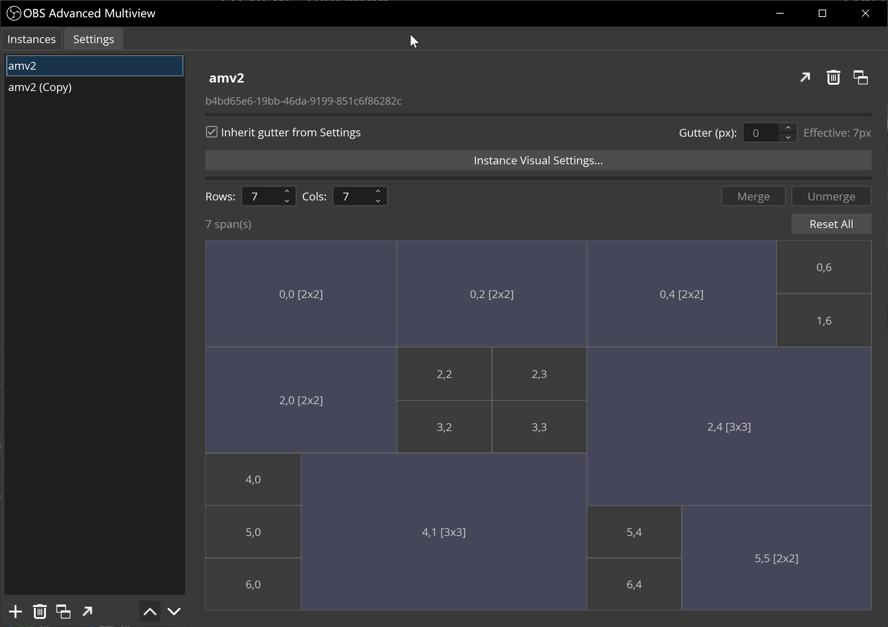
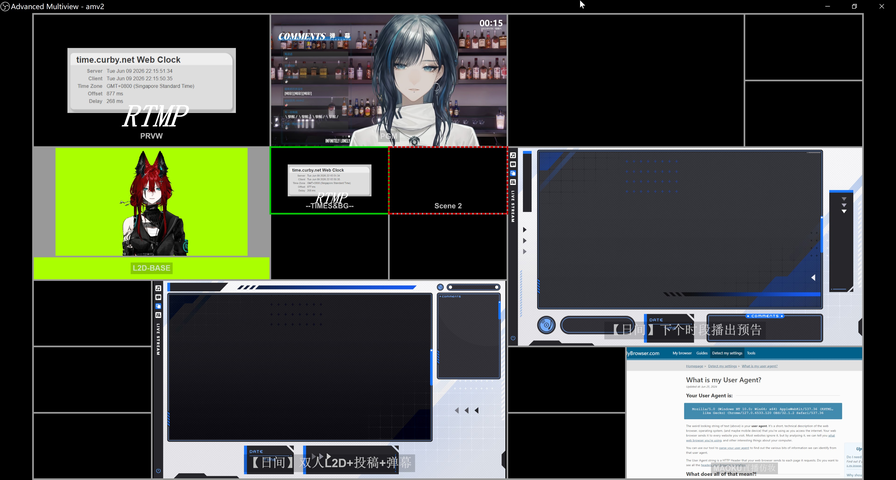

# OBS Advanced Multiview

OBS Advanced Multiview is an OBS Studio plugin that extends the built-in Multiview.

The built-in OBS Multiview is useful, but it is limited to fixed layouts and OBS internal scene monitoring. This plugin adds custom layouts, merged cells, per-cell display settings, external signal cells, audio-only cells, signal-lost handling, and multiple saved multiview instances.

It is intended for users who need OBS itself to provide a more complete monitoring view: live directors, stream operators, audio operators, VTuber teams, event crews, or anyone running a production where the default Multiview is too fixed.

[简体中文](README.cn.md)

| Manager | Multiview window |
| --- | --- |
|  |  |

## Compared with OBS Multiview

OBS Advanced Multiview keeps the same basic idea as OBS Multiview, but removes several fixed assumptions.

- OBS Multiview uses preset layouts. This plugin supports **custom rows, columns, merged cells, and gutter spacing**.
- OBS Multiview mainly monitors Program, Preview, and scenes. This plugin can also monitor **individual sources, audio-only sources, media URLs/files, NDI, Spout, and VLC playlists**.
- OBS Multiview has one global presentation style. This plugin has **global, instance, and per-cell display settings**.
- OBS Multiview does not provide detailed per-cell signal-lost handling. This plugin can show **missing-source states, placeholder images, signal-lost images, fallback states, and reconnect controls**.
- OBS Multiview is tied to one set of monitor views. This plugin lets you save **multiple multiview instances** with different layouts and settings, and open **several projector windows of the same instance at once**, all sharing one set of sources.
- OBS Multiview does not create external monitoring feeds. This plugin creates external provider cells as private OBS sources where possible, so they do not need to be added to your normal scenes.
- OBS Multiview cannot show one multiview inside another. This plugin can use **another Advanced Multiview instance as a cell**, nesting one instance's composited view (full or grid-only) inside another instance or itself.
- OBS Multiview cannot send its anywhere. This plugin can **output the composed multiview as an NDI, Spout, DeckLink, or AJA signal** (video, plus audio where supported), without routing it through a scene filter output.

## Features

### Layouts and Windows

- Multiple saved multiview instances.
- **Multiple projector windows per instance**, all sharing one set of sources.
- **Custom row and column counts.**
- **Merged cells / span regions.**
- Gutter spacing from 0 to 50 px.
- Zero-gutter layouts with internal PGM/PRVW highlight borders.
- Layout and signal assignments are saved with the OBS scene collection.

### Internal OBS Monitoring

- Program cells.
- Preview cells.
- Scene cells.
- Source cells.
- **Audio-only source cells.**
- Scene-click switching: click a scene cell to send it to Preview in Studio Mode, or directly to Program outside Studio Mode.
- Optional double-click action for sending a scene cell to Program.

### External Signal Cells

- **FFmpeg media URLs and local files.**
- **DistroAV NDI sources.**
- **obs-spout2 Spout senders.**
- **VLC playlist cells** when OBS VLC source support is available.
- WebRTC is present as a placeholder provider, but runtime support is not implemented yet.
- NDI and Spout are accessed through host OBS plugins. This plugin does not bundle the NDI SDK or a separate Spout SDK.

### Nested Multiview Cells

- **Another Advanced Multiview instance as a cell** — show one instance's live composited grid inside a cell of another instance, or of itself.
- **Full or grid-only picture** — the target's full composition (labels, VU meters, highlight, overlays), or just its per-cell pictures.
- **Per-cell resolution** — follow the pulling window, follow the primary screen, or a fixed manual preset.
- Reads the target's last composited frame in-process, with no extra output routing to set up; cross-reference, self-reference, and deep nesting stay stable.

### External Output

- **NDI output of the composed multiview** (video + audio).
- **Spout output of the composed multiview** (Windows, video only).
- **DeckLink output of the composed multiview** to Blackmagic SDI/HDMI hardware (video + audio).
- **AJA output of the composed multiview** to AJA SDI/HDMI hardware (video + audio).
- DeckLink settings include the device, hardware mode, keyer mode, Force SDR, and audio track selection.
- AJA settings include the device, I/O connection, video format, pixel format, SDI transport, and audio track selection.
- Output audio source: follow the streaming track, a manual track, or none.
- Output runs independently of scenes and keeps sending with no window open.
- Selectable output resolution and frame rate for NDI and Spout; DeckLink and AJA use the selected hardware format.

### Visual Settings

- **Global visual settings.**
- **Instance visual settings.**
- **Per-cell visual settings.**
- Background color.
- Background image.
- Label display modes.
- Safe area guides.
- Foreground overlay image.
- PGM/PRVW highlight borders.
- **Nested scene detection** for PGM/PRVW highlights, with a selectable nested-match border style (dashed, solid, or none).
- **VU meters.**
- VU peak hold.
- VU dB scale ticks and labels.
- **VU multi-channel display** based on source channel count.
- **VU RMS / magnitude indicator.**

### Signal-Lost Handling

- **Missing-source overlay.**
- **Signal-lost overlay.**
- Placeholder image.
- Signal-lost image.
- Fallback image.
- Fallback to PGM, PRVW, scene, or source where supported.
- **Reconnect Now** action.
- Retry and fallback behavior for external providers.
- Replay, previous, play/pause, and next actions for supported media providers.

### Workflow Details

- **Right-click cell menu** for source assignment, source editing, display settings, signal-lost settings, reconnect, and media controls.
- Settings are stored under OBS plugin configuration paths.
- English and Simplified Chinese UI localization.
- Built with the OBS plugin template, Qt 6, C++17, libobs, and OBS frontend APIs.
- Windows is the primary tested platform for the current release candidate.

## Stability and OBS Isolation

A multiview is a monitoring tool, so the plugin is built to one rule: **it must never crash, stall, or block OBS** — a fault on an OBS thread would take down the whole live program.

- **The render path never calls OBS frontend APIs.** Program / Preview / streaming state is read from a snapshot updated on OBS's main thread, so drawing a cell cannot race a scene switch.
- **One stream pull per instance.** All windows of an instance share a single set of sources and VU meters; opening another window of the same multiview does not pull the signal again.
- **Output keeps running with no window open.** With external output on, an instance whose windows are all closed stays alive as a headless host and keeps sending.
- **Teardown is use-after-free safe.** Closing a window or switching scene collections detaches the instance before anything is destroyed.

Performance work keeps the multiview from pressuring the program output during a busy show:

- **Multiview window render rate (Full / Half, default Half).** Half composes the grid at half the base frame rate and reuses the last frame between, roughly halving each window's render cost; offered only above 30 fps.
- **NDI output goes idle with no receiver.** When nothing is pulling the output, the GPU readback and encode are skipped while the sender stays discoverable, until a receiver connects.
- **Optional NDI readback double-buffer** (on by default) protects the program output from a readback stall on slow GPUs at the cost of one frame; turn it off for lowest latency and tight A/V sync.

## Requirements

- OBS Studio 31.1.1 or newer.
- Windows is the primary tested platform.
- Optional host plugins for external provider **cells**:
  - DistroAV for NDI cells
  - obs-spout2 for Spout cells
  - OBS VLC source support for VLC playlist cells
- For **NDI output**, an NDI 5 or 6 runtime (NDI Tools or the NDI redistributable) installed. NDI output is built in and does not need DistroAV.
- For **DeckLink output**, OBS must have its DeckLink output plugin available and a supported Blackmagic DeckLink device must be detected. The selected hardware mode must match the OBS canvas frame rate.
- For **AJA output**, OBS must have its AJA output plugin available and a supported AJA device must be detected. The selected video format must match the OBS canvas frame rate.

macOS and Linux support is planned through the cross-platform build system, but current validation is Windows-first.

## Installation

Download a release archive from GitHub Releases.

For OBS portable installs, use the portable archive and extract it into the OBS root folder so the final layout contains:

```text
obs-plugins/64bit/obs-advanced-multiview.dll
data/obs-plugins/obs-advanced-multiview/locale/en-US.ini
data/obs-plugins/obs-advanced-multiview/locale/zh-CN.ini
```

Restart OBS, then open the plugin from:

```text
Tools -> OBS Advanced Multiview
```

For development or local testing, the deployment script can copy the latest build into configured OBS portable folders:

```powershell
.\docs\setup\deploy-plugin.ps1 RelWithDebInfo
```

## Quick Start

1. Open `Tools -> OBS Advanced Multiview`.
2. Create an instance.
3. Set rows, columns, merged cells, and gutter spacing.
4. Right-click a cell in the multiview window and choose `Add Source...`.
5. Use `Cell Display Settings...`, `Signal Lost Settings...`, and `Instance Visual Settings...` to tune the presentation.

## Merging Cells

Cell merging is done in the manager window, not in the multiview render window.

1. Open `Tools -> OBS Advanced Multiview`.
2. Select an instance in the left list.
3. In the instance detail panel, set the grid `Rows` and `Cols`.
4. In the grid preview, click cells to select them. A normal click selects one cell. `Shift` + left-click selects a rectangular range from the previous clicked cell to the clicked cell, which is the fastest way to select cells before merging. `Ctrl` + click toggles cells in the current selection. Clicking an existing span selects the whole span area.
5. Click `Merge` to create a span from the selected cells.
6. Click a merged cell and use `Unmerge` to remove that span, or use `Reset All` to remove all spans in the current layout.

Merge rules:

- The selected cells must form one filled rectangle.
- A 1x1 selection is not a merge.
- The rectangle must stay inside the current grid.
- The rectangle cannot partially overlap an existing span.
- If the rectangle fully contains one or more existing spans, those spans are absorbed into the new merged region.
- If rows or columns are reduced, spans outside the new grid are removed safely.

## Build From Source

The project uses the OBS plugin template build system, CMake, Qt 6, C++17, and the OBS frontend API.

On Windows:

```powershell
cmake --preset windows-x64
cmake --build build_x64 --config RelWithDebInfo --target obs-advanced-multiview
.\docs\setup\deploy-plugin.ps1 RelWithDebInfo
```

See [docs/setup/README.md](docs/setup/README.md) for first-time setup and troubleshooting.

### NDI output

The built-in **NDI external output** (video + audio) builds out of the box on **Windows, macOS, and Linux**: the [NDI SDK](https://ndi.video/for-developers/ndi-sdk/) headers are vendored in [`deps/ndi/`](deps/ndi/README.md) (headers only — no import library, no bundled library), so neither CI nor contributors need to install the SDK. To build against a locally installed SDK instead, set the `NDI_SDK_DIR` environment variable (or install to the default path); it takes precedence over the vendored headers.

At runtime the plugin loads the NDI runtime library dynamically (nothing is bundled), so end users need the [NDI runtime](http://ndi.link/NDIRedistV6) (or NDI Tools) installed. An NDI 5 or NDI 6 runtime both work.

### DeckLink output

The built-in **DeckLink external output** reuses OBS's registered `decklink_output` type and does not require a separate DeckLink SDK to build. At runtime, OBS must provide the DeckLink output plugin and detect a compatible Blackmagic device. Available modes are filtered to the OBS canvas frame rate; the output uses the selected hardware mode's native raster and can include SDI/HDMI audio.

### AJA output

The built-in **AJA external output** reuses OBS's registered `aja_output` type and does not require the AJA NTV2 SDK to build. At runtime, OBS must provide the AJA output plugin (built with NTV2 support) and detect a compatible AJA device. Available video formats are filtered to the OBS canvas frame rate; the output uses the selected format's native raster and can include SDI/HDMI audio.

## Documentation

- [Development workflow](docs/DEVELOPMENT.md)
- [Setup guide](docs/setup/README.md)
- [Distribution notes](docs/setup/DISTRIBUTION.md)
- [Roadmap](docs/ROADMAP.md)
- [Known limitations](docs/known-limitations.md)
- [Terminology](docs/TERMINOLOGY.md)

Design and implementation notes are kept under [docs](docs/). Project milestones and future work are tracked in [docs/ROADMAP.md](docs/ROADMAP.md).

## Current Status

The 1.0 release candidate focuses on Windows operation, custom multiview layouts, **multiple projector windows per instance**, internal OBS source monitoring, external media/NDI/Spout/VLC provider cells, **NDI/Spout/DeckLink/AJA external output**, signal-lost handling, visual customization, and bilingual English / Simplified Chinese UI.

## License

This project is licensed under GPL-2.0-or-later. See [LICENSE](LICENSE).
